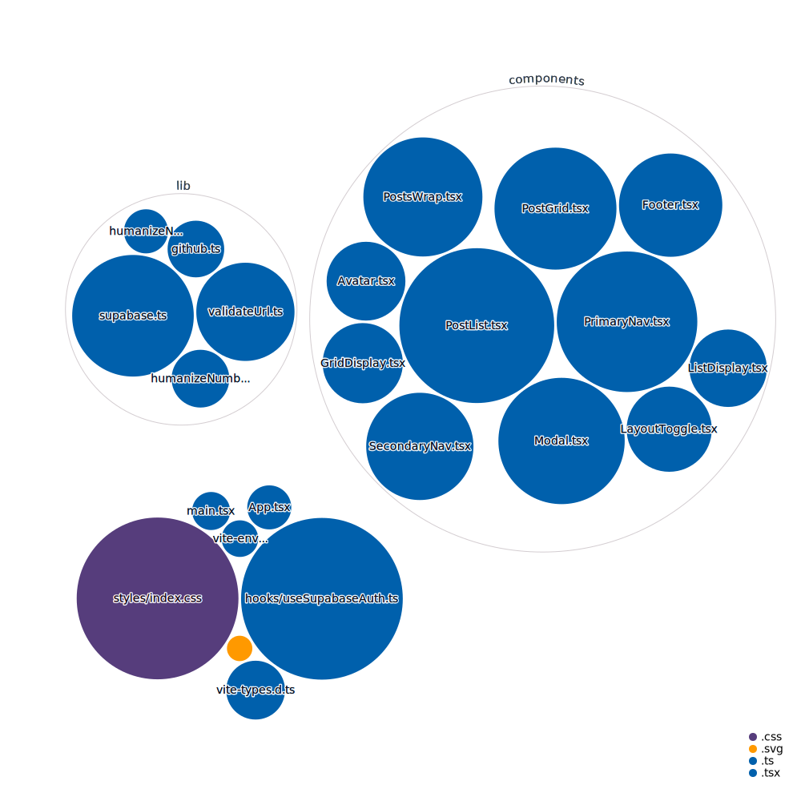

<div align="center">
  <br>
  
  <h1>🍕 Open Sauced Vite Typescript Template Test 🍕</h1>
  <strong>The path to your next Open Source contribution</strong>
</div>
<br>
<p align="center">
  
  
  <a href="https://github.com/0-vortex/open-sauced-vite-ts-template-test/issues">
    
  </a>
  <a href="https://github.com/0-vortex/open-sauced-vite-ts-template-test/releases">
    
  </a>
  <a href="https://discord.gg/U2peSNf23P">
    
  </a>
  <a href="https://twitter.com/saucedopen">
    
  </a>
</p>


## 📖 Prerequisites

In order to run the project we need the following software binaries installed on our development machines: 
- `node>=16.7.0`
- `npm>=8.0.0`
- `docker>=20.10.12`
- `supabase>=0.18.0`

## 🖥️ Local development

To install the application:

```shell
npm ci
```

To start a local copy of the app on port `3000`:

```shell
npm start
```

### 🧪 Test

For running the test suite, use the following command. Since the tests run in watch mode by default, some users may encounter errors about too many files being open. In this case, it may be beneficial to [install watchman](https://facebook.github.io/watchman/docs/install.html).

```shell
npm test
```

You can request a coverage report by running the following command:

```shell
npm run test:coverage
```

### 📦 Docker builds

A development preview can also be run from docker:

```shell
docker build -t open-sauced-template .
docker run -p 8080:80 open-sauced-template
```

Alternatively you can pull the production container and skip all builds:

```shell
docker run -dit -p 8080:80 ghcr.io/open-sauced/open-sauced
```

### 🎨 Code linting

To check the code and styles quality, use the following command:

```shell
npm run lint
```

This will also display during development, but not break on errors.

To fix the linting errors, use the following command:

```shell
npm run format
```

### 🚀 Production deployment

A production deployment is a complete build of the project, including the build of the static assets.

```shell
npm run build
```

You can analyze the build by running the following command:

```shell
npm run build:analyze
```

### 🎭 Offline asset optimization

We also have a script for updating `.svg` files used in the project, you only need to run this if you add new assets:

```shell
npm run build:svgo
```

And one for `.png` and `.jpg` files:

```shell
npm run build:squoosh
```

### 🚧 Development debugging

Thanks to [antfu/vite-plugin-inpesct](https://github.com/antfu/vite-plugin-inspect) we can always inspect the bundles in development by navigating to [localhost:3000/__inspect/](http://localhost:3000/__inspect/) in your browser.

## 🤝 Contributing

We encourage you to contribute to Open Sauced! Please check out the [Contributing guide](https://docs.opensauced.pizza/contributing/introduction-to-contributing/) for guidelines about how to proceed.


## 🍕 Community

Got Questions? Join the conversation in our [Discord](https://discord.gg/U2peSNf23P).  
Find Open Sauced videos and release overviews on our [YouTube Channel](https://www.youtube.com/channel/UCklWxKrTti61ZCROE1e5-MQ).

## 🎦 Repository Visualization

[
](./src)

## ⚖️ LICENSE

MIT © [Open Sauced](LICENSE)
